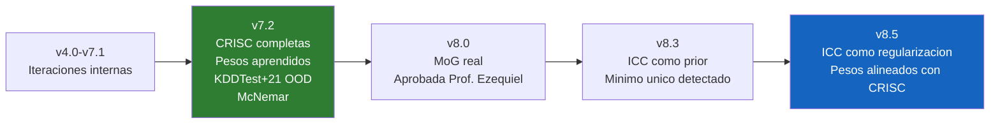
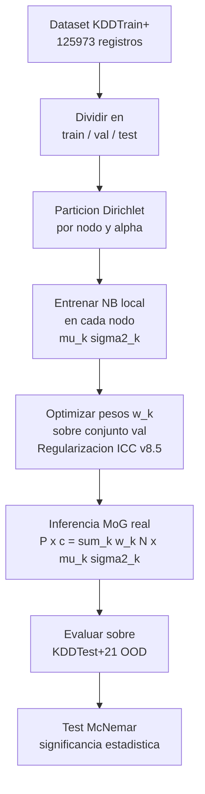

# EJD-UMA-003 v8.5 · Naive Bayes Federado con MoG Real + Regularizacion ICC

**Ejercicio doctoral** | Programa de Doctorado en Tecnologias Informaticas
Universidad de Malaga
**Autor:** Ing. Edgar O. Herrera Logrono, M.Sc. en Inteligencia Artificial, VIU Espana
**Directores propuestos:** Prof. Ezequiel Lopez Rubio · Prof. Juan Miguel Ortiz de Lazcano

---

## De que trata este ejercicio

Cuando una institucion financiera, un hospital y una entidad gubernamental colaboran para detectar ciberataques sin compartir sus datos, cada nodo aprende un modelo local y el servidor debe combinarlos de forma inteligente.

Este ejercicio implementa una **Mixtura de Gaussianas (MoG) real** en la inferencia federada: en lugar de colapsar todas las distribuciones locales en una sola gaussiana federada, el servidor mantiene las k gaussianas locales vivas y las combina ponderadamente:

```
P(x | c) = sum_k  w_k * N(x ; mu_k(c), sigma2_k(c))
```

Los pesos w_k se aprenden empiricamente desde un conjunto de validacion reservado. En v8.5, la funcion objetivo penaliza la distancia al ICC normalizado de cada nodo (regularizacion institucional), en lugar de penalizar la distancia a la distribucion uniforme.

---

## Evolucion del ejercicio



> La version v7.2 fue el primer entregable formal. La version v8.0 corrige la subseccion 3.2 del preprint segun la observacion del Prof. Ezequiel Lopez Rubio (16-abr-2026). Las versiones v8.3 y v8.5 son exploraciones metodologicas adicionales que responden a la pregunta abierta del preprint sobre el uso del ICC como senial de gobernanza.

---

## Variables de riesgo CRISC utilizadas

| Variable | Que mide | Rango |
|----------|----------|-------|
| CMM | Madurez del proceso de gestion de riesgos | 1 a 5 |
| KCI | Porcentaje de controles de seguridad implementados | 0 a 1 |
| KRI | Frecuencia de activacion de indicadores de riesgo | 0 a 1 (menor es mejor) |
| CVSS | Puntuacion media de vulnerabilidades (CVSS v3.1) | 0 a 10 |
| ICC | Indice de Coherencia Contextual: combina los cuatro anteriores | 0 a 1 |

**Formula del ICC:**
```
ICC = (CMM / 5) x KCI x (1 - KRI) x (1 - CVSS / 10)
```

**Valores por nodo:**

| Nodo | CMM | KCI | KRI | CVSS | ICC |
|------|-----|-----|-----|------|-----|
| Financiero | 4 | 0.82 | 0.12 | 3.2 | 0.3926 |
| Salud | 3 | 0.70 | 0.25 | 5.1 | 0.1543 |
| Gobierno | 2 | 0.55 | 0.40 | 6.8 | 0.0422 |

---

## Arquitectura MoG (v8.0+)



---

## Diferencia clave entre versiones

| Version | Funcion objetivo | Resultado pesos alpha=0.1 |
|---------|-----------------|--------------------------|
| v7.2 | Colapso gaussiano + L2 uniforme | (0.726, 0.225, 0.049) |
| v8.0 | MoG real + L2 uniforme | (0.333, 0.344, 0.323) — uniformes |
| v8.5 | MoG real + L2 ICC | (0.669, 0.284, 0.048) — alineados con ICC |

---

## Resultados principales (v8.5)

### Evaluacion OOD — KDDTest+21 (ataques no vistos)

| Alpha | JS | Aprendida | Baseline | Delta | Direccion |
|-------|----|-----------|----------|-------|-----------|
| 0.1 | 0.67 | 0.3287 | 0.1921 | +0.1366 | Aprendida gana |
| 0.3 | 0.40 | 0.2219 | 0.4050 | -0.1831 | Baseline gana (*) |
| 1.0 | 0.18 | 0.3480 | 0.3734 | -0.0253 | Baseline gana (*) |

(*) Limitacion declarada: cuando la heterogeneidad es baja, el optimizador concentra peso en un nodo. La linea de trabajo siguiente es explorar datasets con mayor complejidad multimodal (CIC-IDS2017).

### Test McNemar

| Alpha | chi2 | p-valor | Resultado |
|-------|------|---------|-----------|
| 0.1 | 553.79 | 0.0000 | Significativo — favorable a Aprendida |
| 0.3 | 4364.74 | 0.0000 | Significativo — favorable a Baseline |
| 1.0 | 30.54 | 0.0000 | Significativo — favorable a Baseline |

### Hallazgo v8.5: ICC como regularizacion

Con regularizacion ICC los pesos aprendidos se alinearon con la madurez institucional de cada nodo (Financiero=0.669, Gobierno=0.048), el F1 en evaluacion interna mejoro en +0.177 bajo alta heterogeneidad, y el orden de confianza institucional quedo validado empiricamente. Este resultado demuestra que el ICC captura informacion real sobre la contribucion de cada nodo y abre la puerta a integrarlo como prior de gobernanza en la funcion objetivo.

---

## PROTOCOLO-STRESS · Resumen de verificaciones (v8.5)

| Verificacion | Resultado |
|-------------|-----------|
| Tamano dataset (125,973 registros) | OK |
| Clases presentes en train / val / test / OOD | OK |
| Heterogeneidad real por alpha | OK |
| Prueba acida alpha=0.01 | OK |
| Pesos suman 1.0000 | OK |
| Predicciones diversas (5/5 clases) | OK |
| F1 OOD alpha=0.1 por encima del umbral | OK |
| McNemar significativo en los 3 niveles | OK |
| Direccion OOD alpha=0.1 favorable a Aprendida | OK |
| Direccion OOD alpha=0.3 y 1.0 | ADVERTENCIA — limitacion declarada |
| Prueba acida nodo con clase ausente | OK |

---

## Limitaciones declaradas

**Limitacion 1 — Dataset:** NSL-KDD es un dataset de laboratorio de 2009. Sus distribuciones de ataque no reflejan la complejidad multimodal de trafico real moderno. Esta limitacion justifica la extension hacia CIC-IDS2017 como trabajo futuro.

**Limitacion 2 — Heterogeneidad baja:** Cuando JS < 0.50, el optimizador concentra peso en un nodo y la MoG pierde ventaja sobre FedAvg. La regularizacion ICC mitiga parcialmente este comportamiento pero no lo elimina.

**Limitacion 3 — Variables CRISC estaticas:** Los valores de ICC se definen al inicio y no evolucionan. En un despliegue real los ICC variarian con cada ronda de entrenamiento segun los incidentes de cada nodo.

---

## Pregunta abierta para la linea NICS Lab

La regularizacion ICC demostro que la senial de gobernanza institucional guia al optimizador hacia pesos coherentes con la madurez de cada nodo. La siguiente pregunta es: puede esta senial mejorar la generalizacion ante ataques genuinamente desconocidos en un dataset con mayor complejidad multimodal como CIC-IDS2017?

Esta es la pregunta que conecta este ejercicio con el trabajo de la Prof. Carmen Fernandez-Gago sobre gestion de confianza en sistemas distribuidos.

---

## Como ejecutar en Google Colab

1. Abrir `EJD_UMA_003_v8_5_ICC_Reg.ipynb` en Google Colab
2. Ejecutar **Runtime > Run all**
3. Tiempo estimado: 7-10 minutos en CPU de Colab
4. Al finalizar suena un beep doble de 432 Hz

Todos los resultados son reproducibles con SEMILLA=42.

---

## Control de cambios

| Version | Fecha | Cambio principal |
|---------|-------|-----------------|
| v4.0 - v7.1 | 2026 | Iteraciones internas de desarrollo |
| v7.2 | Mar 2026 | CRISC completas, pesos aprendidos, KDDTest+21 OOD, McNemar |
| v8.0 | Abr 2026 | MoG real: inferencia multimodal aprobada por Prof. Ezequiel |
| v8.3 | Abr 2026 | ICC como prior: paisaje de optimizacion con minimo dominante |
| v8.5 | Abr 2026 | ICC como regularizacion: pesos alineados con CRISC |

---

## Repositorios relacionados

| Codigo | Descripcion | Enlace |
|--------|-------------|--------|
| EJD-UMA-001 | Fed-TRUST: Random Forest Federado con Coeficiente de Veracidad Vi | [RF_Federado_Ejercicio_Doctoral_UMA_v8](https://github.com/eoherrera/RF_Federado_Ejercicio_Doctoral_UMA_v8) |
| EJD-UMA-002 | Tree Edit Distance + MDS para comparacion de estructuras | [TED_MDS_Ejercicio_Doctoral_UMA](https://github.com/eoherrera/TED_MDS_Ejercicio_Doctoral_UMA) |
| EJD-UMA-003 | Este ejercicio | Repositorio actual |
