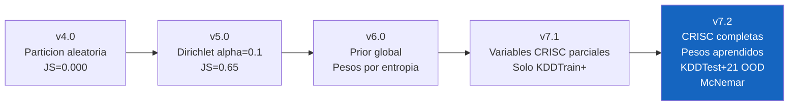
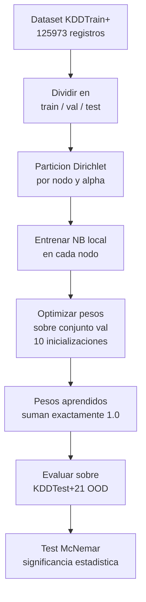

# EJD-UMA-003 v7.2 · Naive Bayes Federado con Variables de Riesgo

**Ejercicio doctoral** | Programa de Doctorado en Tecnologias Informaticas  
Universidad de Malaga  
**Autor:** Ing. Edgar O. Herrera Logrono, M.Sc. en Inteligencia Artificial  
**Directores propuestos:** Prof. Ezequiel Lopez Rubio · Prof. Juan Miguel Ortiz de Lazcano  

---

## De que trata este ejercicio

Cuando una institucion financiera, un hospital y una entidad gubernamental quieren colaborar para detectar ciberataques sin compartir sus datos entre ellos, surge un problema concreto: cada uno aprende un modelo local, y luego hay que combinar esos modelos de alguna manera.

La forma mas simple de combinarlos es promediar sus parametros. Pero eso asume que los tres tienen la misma importancia, lo cual rara vez es cierto. Un nodo con sistemas maduros y pocos incidentes deberia pesar mas que uno con controles debiles.

Este ejercicio propone una respuesta a esa pregunta: en lugar de asignar pesos de forma arbitraria, se aprenden desde los propios datos. Y para validar que los pesos tienen sentido institucional, se comparan contra variables de gestion de riesgos reales (CRISC): madurez del proceso, cobertura de controles, frecuencia de incidentes y exposicion a vulnerabilidades.

---

## Evolucion del ejercicio

> **Nota:** Las versiones v4.0 a v7.1 son iteraciones internas de desarrollo y ajuste metodologico, realizadas durante el proceso de aprendizaje previo a la entrega formal. La version v7.2 es el primer entregable que incorpora todas las correcciones solicitadas por el Prof. Lopez Rubio.



---

## Variables de riesgo CRISC utilizadas

Estas variables provienen del marco de certificacion CRISC (Certified in Risk and Information Systems Control, ISACA) y representan la situacion real de cada nodo institucional:

| Variable | Que mide | Rango |
|----------|----------|-------|
| CMM | Nivel de madurez en gestion de riesgos (CMMI) | 1 a 5 |
| KCI | Porcentaje de controles de seguridad implementados | 0 a 1 |
| KRI | Frecuencia con que se activan indicadores de riesgo | 0 a 1 (menor es mejor) |
| CVSS | Puntuacion media de vulnerabilidades del nodo (CVSS v3.1) | 0 a 10 |
| ICC | Indice de Coherencia Contextual: combina los cuatro anteriores | 0 a 1 |

**Formula del ICC:**
```
ICC = (CMM / 5) x KCI x (1 - KRI) x (1 - CVSS / 10)
```

Un nodo con CMM alto, muchos controles activos, pocos incidentes y vulnerabilidades bajas obtiene un ICC cercano a 1. Un nodo debil se acerca a 0.

**Valores usados en este ejercicio:**

| Nodo | CMM | KCI | KRI | CVSS | ICC |
|------|-----|-----|-----|------|-----|
| Financiero | 4 | 0.82 | 0.12 | 3.2 | 0.3926 |
| Salud | 3 | 0.70 | 0.25 | 5.1 | 0.1543 |
| Gobierno | 2 | 0.55 | 0.40 | 6.8 | 0.0422 |

---

## Como funciona el aprendizaje de pesos

En versiones anteriores los pesos se asignaban a mano o por heuristica (entropia local). El Prof. Lopez Rubio senalo que eso no tiene justificacion empirica.

En v7.2 los pesos se aprenden asi:



La funcion objetivo minimiza `(1 - F1_macro_validacion) + regularizacion_L2`. La regularizacion penaliza que un solo nodo acapare todo el peso, forzando una distribucion mas balanceada.

---

## Resultados principales

### Evaluacion interna (KDDTrain+)

F1-macro varia entre 0.14 y 0.47. Las diferencias son visibles pero no tienen suficiente separacion estadistica para discriminar entre modelos en un dataset de laboratorio. Este es el techo de F1 que el Prof. Lopez Rubio identifico.

### Evaluacion OOD (KDDTest+21  - ataques no vistos en entrenamiento)

| Alpha | JS | Aprendida | Baseline | Delta | Direccion |
|-------|----|-----------|----------|-------|-----------|
| 0.1 | 0.67 | 0.4855 | 0.1921 | +0.2935 | Aprendida gana |
| 0.3 | 0.40 | 0.3904 | 0.4050 | -0.0146 | Baseline gana |
| 1.0 | 0.18 | 0.3637 | 0.3734 | -0.0097 | Baseline gana |

**Alpha** controla que tan distintos son los nodos entre si. Alpha=0.1 simula tres instituciones con perfiles de ataque muy diferentes (JS=0.67). Alpha=1.0 simula instituciones casi iguales (JS=0.18).

### Test McNemar (significancia estadistica)

Todos los resultados son estadisticamente significativos (p=0.0000). La diferencia en alpha=0.1 no es ruido  - chi2=3630, lo que equivale a decir que la probabilidad de observar esta diferencia por azar es practicamente cero.

---

## Figuras generadas

**Figura 1**  - F1-macro por nivel de heterogeneidad (evaluacion interna KDDTrain+)  
Muestra que en condiciones de laboratorio las diferencias entre modelos son visibles pero no suficientes para discriminar estadisticamente.

**Figura 2**  - F1-macro OOD y estadistico McNemar  
Muestra donde la Mezcla Aprendida supera al Baseline (alta heterogeneidad) y donde no (heterogeneidad moderada/baja). El panel derecho presenta el chi2 de McNemar por nivel de alpha.

**Figura 3**  - ICC (variables CRISC) vs pesos aprendidos  
Muestra la correlacion entre el indice de confianza institucional de cada nodo y el peso que el algoritmo le asigno. El nodo Gobierno, con ICC mas bajo, recibio consistentemente el menor peso.

---

## PROTOCOLO-STRESS · Resumen de verificaciones

Este ejercicio incluye una seccion de verificacion sistematica antes y despues del experimento, que responde directamente la pregunta del Prof. Lopez Rubio sobre suficiencia y variabilidad del dataset.

| Verificacion | Resultado |
|-------------|-----------|
| Tamano dataset (125,973 registros) | OK |
| Clases presentes en train / val / test / OOD | OK |
| Heterogeneidad real por alpha | OK |
| Prueba acida alpha=0.01 | OK |
| Pesos suman 1.0000 | OK |
| Predicciones diversas (5/5 clases) | OK |
| F1 OOD por encima del azar | OK |
| McNemar significativo | OK |
| Direccion OOD alpha=0.1 | OK |
| Direccion OOD alpha=0.3 y 1.0 | ADVERTENCIA  - limitacion declarada |
| Prueba acida nodo con clase ausente | OK |

---

## Limitaciones declaradas

**Limitacion 1  - Dataset:** NSL-KDD es un dataset de laboratorio creado en 2009. Los patrones de ataque estan bien definidos y los modelos los aprenden con facilidad. En un entorno real con trafico actual, los resultados serian distintos.

**Limitacion 2  - Pesos en heterogeneidad baja:** Cuando los nodos son similares (alpha=0.3 y 1.0), el optimizador concentra el peso en un nodo y pierde la diversidad que beneficia la generalizacion OOD. La Mezcla Aprendida pierde contra el Baseline en esas condiciones. Esta limitacion es la linea de trabajo del siguiente ejercicio.

**Limitacion 3  - Variables CRISC estaticas:** Los valores de CMM, KCI, KRI y CVSS se definen al inicio y no cambian durante el experimento. En una implementacion real estos valores variarian segun los incidentes de cada nodo en cada ronda de entrenamiento.

---

## Pregunta abierta para la linea NICS Lab

Si el ICC de cada nodo captura su nivel de madurez institucional, seria posible usarlo como punto de partida del optimizador en lugar de una inicializacion aleatoria? Un prior basado en ICC reduciria el numero de iteraciones y mejoraria la convergencia en escenarios donde el conjunto de validacion es pequeno. Esa es la pregunta que conecta este ejercicio con el trabajo de la Prof. Carmen Fernandez-Gago sobre gestion de confianza en sistemas distribuidos.

---

## Como ejecutar en Google Colab

1. Abrir el archivo `.ipynb` en Google Colab
2. Ejecutar **Runtime > Run all**
3. El programa muestra un aviso con el tiempo estimado antes de empezar
4. Tiempo tipico: 3 a 5 minutos en CPU de Colab

No se requiere configuracion adicional. El dataset se descarga automaticamente desde GitHub al inicio de la ejecucion.

---

## Control de cambios

| Version | Fecha | Cambio principal |
|---------|-------|-----------------|
| v4.0 | Ene 2026 | Particion aleatoria, pesos por F1 |
| v5.0 | Feb 2026 | Particion Dirichlet, heterogeneidad real |
| v6.0 | Mar 2026 | Prior global, pesos por entropia, variables ICC/CMM/KCI |
| v7.1 | Mar 2026 | Variables CRISC parciales, evaluacion solo KDDTrain+ |
| v7.2 | Abr 2026 | CRISC completas (KRI, CVSS), pesos aprendidos desde validacion, KDDTest+21 OOD, McNemar, PROTOCOLO-STRESS |

---

## Repositorios relacionados

| Codigo | Descripcion | Enlace |
|--------|-------------|--------|
| EJD-UMA-001 | Fed-TRUST: Random Forest Federado con Coeficiente de Veracidad Vi | [RF_Federado_Ejercicio_Doctoral_UMA_v8](https://github.com/edgarherrera/RF_Federado_Ejercicio_Doctoral_UMA_v8) |
| EJD-UMA-002 | Tree Edit Distance + MDS para comparacion de estructuras | Disponible en GitHub |
| EJD-UMA-003 | Este ejercicio | Repositorio actual |
