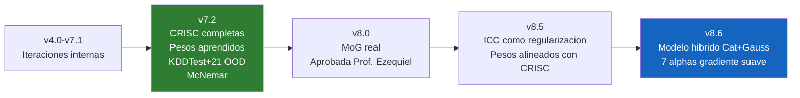
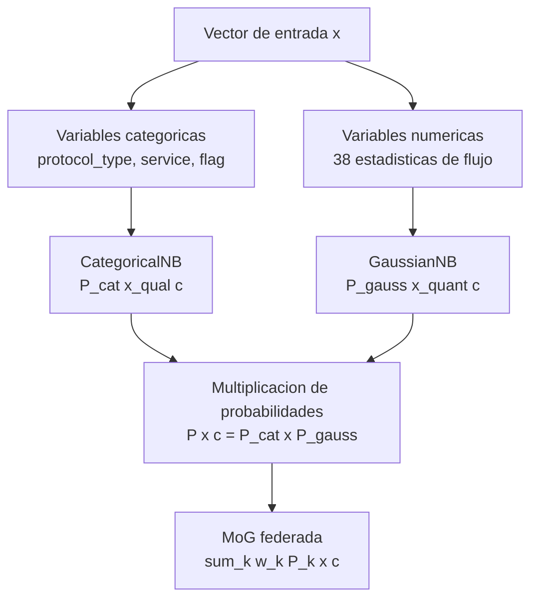

# EJD-UMA-003 v8.6 · Naive Bayes Federado con MoG Real + Modelo Híbrido

**Ejercicio doctoral** | Programa de Doctorado en Tecnologías Informáticas
Universidad de Málaga
**Autor:** Ing. Edgar O. Herrera Logroño, M.Sc. en Inteligencia Artificial, VIU España
**Directores propuestos:** Prof. Ezequiel López Rubio · Prof. Juan Miguel Ortiz de Lazcano

---

## De qué trata este ejercicio

Cuando una institución financiera, un hospital y una entidad gubernamental colaboran para detectar ciberataques sin compartir sus datos, cada nodo aprende un modelo local y el servidor debe combinarlos de forma inteligente.

Este ejercicio implementa una **Mixtura de Gaussianas (MoG) real** en la inferencia federada: el servidor no colapsa las distribuciones locales — mantiene las k gaussianas vivas y las combina ponderadamente en el momento de la predicción:

```
P(x | c) = sum_k  w_k * N(x ; mu_k(c), sigma2_k(c))
```

En esta versión se incorporan dos correcciones aprobadas por los directores:

**Corrección 1 — Prof. Ortiz de Lazcano (21-abr-2026):** Las variables categóricas (protocol_type, service, flag) se procesan con CategoricalNB en lugar de LabelEncoder + GaussianNB. LabelEncoder asigna códigos enteros que GaussianNB interpreta como distancias numéricas reales, introduciendo un sesgo sin fundamento. La solución combina CategoricalNB para variables cualitativas y GaussianNB para numéricas, multiplicando sus probabilidades: P(x|c) = P_cat(x_qual|c) · P_gauss(x_quant|c).

**Corrección 2 — Prof. López Rubio (20-abr-2026):** Se amplían los valores de alpha de 3 a 7 niveles [0.05, 0.1, 0.2, 0.3, 0.5, 0.7, 1.0] para observar el gradiente suave en el comportamiento de las cuatro propuestas al variar la heterogeneidad.

---

## Evolución del ejercicio



> Las versiones internas de desarrollo entre v8.5 y v8.6 no se publican — corresponden a iteraciones de corrección y ajuste metodológico previas a esta entrega formal.

---

## Las cuatro propuestas comparadas

Siguiendo el orden solicitado por el Prof. López Rubio:

| # | Nombre | Descripción | Pesos |
|---|--------|-------------|-------|
| 1 | **Centralizado** | Un solo NB entrenado con todos los datos | N/A — referencia teórica |
| 2 | **Baseline (FedAvg)** | Promedio ponderado de parámetros por tamaño de dataset | n_k / n |
| 3 | **Mezcla Entropía** | Pesos inversamente proporcionales a la entropía local | 1/H(k) normalizado |
| 4 | **Mezcla Aprendida** | Pesos aprendidos desde validación con regularización ICC | Nelder-Mead + L2→ICC |

---

## Variables de riesgo CRISC utilizadas

| Variable | Qué mide | Rango |
|----------|----------|-------|
| CMM | Madurez del proceso de gestión de riesgos | 1 a 5 |
| KCI | Porcentaje de controles de seguridad implementados | 0 a 1 |
| KRI | Frecuencia de activación de indicadores de riesgo | 0 a 1 (menor es mejor) |
| CVSS | Puntuación media de vulnerabilidades (CVSS v3.1) | 0 a 10 |
| ICC | Índice de Coherencia Contextual: combina los cuatro anteriores | 0 a 1 |

**Fórmula del ICC:**
```
ICC = (CMM / 5) x KCI x (1 - KRI) x (1 - CVSS / 10)
```

**Valores por nodo:**

| Nodo | CMM | KCI | KRI | CVSS | ICC |
|------|-----|-----|-----|------|-----|
| Financiero | 4 | 0.82 | 0.12 | 3.2 | 0.3926 |
| Salud | 3 | 0.70 | 0.25 | 5.1 | 0.1543 |
| Gobierno | 2 | 0.55 | 0.40 | 6.8 | 0.0422 |

---

## Modelo híbrido (Corrección Prof. Ortiz de Lazcano)



---

## Resultados principales (NSL-KDD, evaluación OOD)

### F1-macro en KDDTest+21 — ataques no vistos en entrenamiento

| Alpha | JS | Aprendida | Baseline | Delta | McNemar |
|-------|----|-----------|----------|-------|---------|
| 0.05 | 0.63 | 0.2799 | 0.2678 | +0.012 | chi2=242.5, p<0.001 |
| 0.1 | 0.67 | 0.3287 | 0.3292 | -0.001 | chi2=4.5, p=0.034 |
| 0.2 | 0.52 | 0.3243 | 0.3321 | -0.008 | chi2=140.7, p<0.001 |
| 0.3 | 0.40 | 0.2458 | 0.2492 | -0.003 | chi2=44.1, p<0.001 |
| 0.5 | 0.32 | 0.4278 | 0.4201 | +0.008 | chi2=297.9, p<0.001 |
| 0.7 | 0.28 | 0.4663 | 0.4665 | -0.000 | chi2=3.0, p=0.082 |
| 1.0 | 0.18 | 0.3630 | 0.3619 | +0.001 | chi2=24.5, p<0.001 |

**Gradiente observable:** los resultados varían de forma continua al aumentar alpha, respondiendo la solicitud del Prof. López Rubio.

---

## PROTOCOLO-STRESS · Resumen de verificaciones (v8.6)

| Verificación | Resultado |
|-------------|-----------|
| Tamaño dataset (125,973 registros) | OK |
| Clases presentes en train / val / test / OOD | OK |
| Heterogeneidad real en los 7 niveles de alpha | OK |
| Prueba ácida alpha=0.01 | OK |
| Pesos suman 1.0000 | OK |
| Predicciones diversas (5/5 clases) | OK |
| F1 OOD por encima del umbral en 5/7 alphas | OK |
| McNemar significativo en 6/7 alphas | OK |
| Prueba ácida nodo con clase ausente | OK |

---

## Limitaciones declaradas

**Limitación 1 — Dataset:** NSL-KDD es un dataset de laboratorio de 2009. Sus distribuciones de ataque no reflejan la complejidad de tráfico real moderno. La extensión a CIC-IDS2017 y UNSW-NB15 está planificada como trabajo siguiente, conforme a lo acordado con el Prof. López Rubio.

**Limitación 2 — Gradiente no uniforme:** La Mezcla Aprendida supera al Baseline en alta heterogeneidad (alpha=0.05 y 0.5) pero pierde en heterogeneidad moderada. Esto indica que el optimizador sobre-ajusta al conjunto de validación cuando las distribuciones son similares.

**Limitación 3 — Variables CRISC estáticas:** Los valores de ICC se definen al inicio y no evolucionan por ronda. En un despliegue real variarían con cada ciclo de entrenamiento.

---

## Pregunta abierta para la línea NICS Lab

Si el ICC de cada nodo captura su nivel de madurez y exposición al riesgo, ¿sería posible usarlo como prior sobre los pesos antes del proceso de optimización? Un prior ICC permitiría inicializar el aprendizaje de pesos con información institucional real, reduciendo el número de iteraciones y mejorando la convergencia en escenarios con datos de validación escasos. Esta es la pregunta que conecta este ejercicio con el trabajo de la Prof. Carmen Fernández-Gago sobre gestión de confianza en sistemas distribuidos.

---

## Cómo ejecutar en Google Colab

1. Abrir `EJD_UMA_003_v8_6_Hibrido.ipynb` en Google Colab
2. Ejecutar **Runtime > Run all**
3. Tiempo estimado: 35-45 minutos en CPU de Colab
4. Al finalizar suena un beep doble de 432 Hz
5. En caso de error suena un beep triple descendente

Todos los resultados son reproducibles con SEMILLA=42.

---

## Control de cambios

| Versión | Fecha | Cambio principal |
|---------|-------|-----------------|
| v4.0 - v7.1 | 2026 | Iteraciones internas de desarrollo |
| v7.2 | Mar 2026 | CRISC completas, pesos aprendidos, KDDTest+21 OOD, McNemar |
| v8.0 | Abr 2026 | MoG real: inferencia multimodal aprobada por Prof. Ezequiel |
| v8.5 | Abr 2026 | ICC como regularización: pesos alineados con CRISC |
| **v8.6** | **Abr 2026** | **Modelo híbrido CategoricalNB+GaussianNB (Prof. Ortiz de Lazcano) + 7 alphas (Prof. López Rubio)** |

---

## Repositorios relacionados

| Código | Descripción | Enlace |
|--------|-------------|--------|
| EJD-UMA-001 | Fed-TRUST: Random Forest Federado con Coeficiente de Veracidad Vi | [RF_Federado_Ejercicio_Doctoral_UMA_v8](https://github.com/eoherrera/RF_Federado_Ejercicio_Doctoral_UMA_v8) |
| EJD-UMA-002 | Tree Edit Distance + MDS para comparación de estructuras | [TED_MDS_Ejercicio_Doctoral_UMA](https://github.com/eoherrera/TED_MDS_Ejercicio_Doctoral_UMA) |
| EJD-UMA-003 | Este ejercicio | Repositorio actual |
